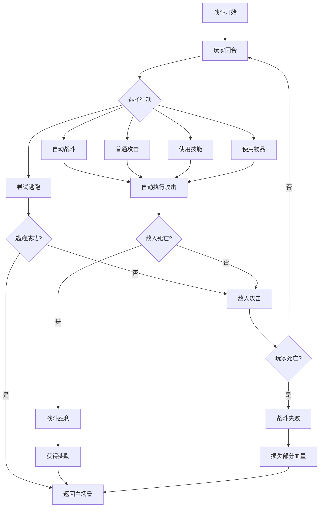

## 1. Product Overview
一个基于InflationRPG玩法的H5回合制RPG游戏，玩家可以控制角色在限定区域内移动，通过遇怪条触发随机战斗，获取装备奖励，提升角色实力。

- 核心玩法：移动探索 + 回合制战斗 + 装备收集
- 目标用户：休闲游戏玩家，喜欢简单有趣的RPG体验

## 2. Core Features

### 2.1 User Roles
| Role | Registration Method | Core Permissions |
|------|---------------------|------------------|
| Player | 无需注册 | 控制角色移动、战斗、管理背包 |

### 2.2 Feature Module
1. **主场景页面**：游戏主视图，包含角色、地图、遇怪条、状态栏
2. **背包页面**：独立打开的物品背包，展示所有掉落装备
3. **战斗页面**：回合制战斗界面，支持自动战斗、恢复、逃跑、技能

### 2.3 Page Details
| Page Name | Module Name | Feature description |
|-----------|-------------|---------------------|
| 主场景 | 角色控制 | WASD或方向键控制角色在限定区域内移动 |
| 主场景 | 遇怪条 | 移动时增加遇怪值(0-100)，满值触发战斗 |
| 主场景 | 状态栏 | 显示角色血量、等级、金币等信息 |
| 主场景 | 菜单按钮 | 打开背包、角色信息等功能入口 |
| 背包 | 物品列表 | 展示所有已获得的装备，支持装备/使用 |
| 背包 | 物品分类 | 按类型分类(武器、防具、消耗品) |
| 战斗 | 战斗界面 | 显示玩家和敌人信息、血量条、技能按钮 |
| 战斗 | 自动战斗 | 自动执行攻击循环，无需手动操作 |
| 战斗 | 恢复功能 | 使用药水恢复生命值 |
| 战斗 | 逃跑功能 | 尝试逃离战斗，有成功率 |
| 战斗 | 技能系统 | 释放不同技能造成伤害或增益 |

## 3. Core Process

### 3.1 游戏主流程
1. 玩家进入游戏，角色出现在初始位置
2. 玩家控制角色在地图内移动
3. 移动时遇怪条逐渐增加
4. 遇怪条满值时触发随机战斗
5. 战斗胜利获得奖励(经验、金币、装备)
6. 战斗失败返回主场景，血量减少
7. 玩家可随时打开背包查看/装备物品

### 3.2 战斗流程

## 4. User Interface Design

### 4.1 Design Style
- **主色调**：深紫色(#4A1C6D)为主色，金色(#FFD700)为强调色
- **按钮风格**：圆角矩形，悬停时有轻微缩放效果
- **字体**：Pixel字体风格，复古游戏感
- **布局**：顶部状态栏，中间游戏区域，底部操作按钮
- **图标**：像素风格图标，简洁明了

### 4.2 Page Design Overview

#### 主场景页面
| Module Name | UI Elements |
|-------------|-------------|
| 顶部状态栏 | 角色头像、等级、血量条、金币数量 |
| 游戏区域 | 地图背景、角色精灵、移动范围限制 |
| 遇怪条 | 底部进度条，从蓝色渐变到红色，显示遇敌概率 |
| 底部按钮 | 背包按钮、角色按钮、设置按钮 |

#### 背包页面
| Module Name | UI Elements |
|-------------|-------------|
| 标题栏 | 背包标题、关闭按钮 |
| 分类标签 | 全部、武器、防具、消耗品 |
| 物品列表 | 网格布局，显示物品图标、名称、数量 |
| 物品详情 | 选中物品时显示属性、装备/使用按钮 |

#### 战斗页面
| Module Name | UI Elements |
|-------------|-------------|
| 敌人区域 | 敌人头像、名称、血量条、状态效果 |
| 战斗日志 | 显示战斗过程中的文字描述 |
| 玩家区域 | 玩家头像、名称、血量条、能量条 |
| 操作按钮 | 自动战斗、攻击、技能、物品、逃跑 |

### 4.3 Responsiveness
- 移动端优先设计，适配手机屏幕
- 触摸操作支持，按钮尺寸适合手指点击
- 响应式布局，在不同屏幕尺寸下保持良好体验

### 4.4 游戏界面风格
- 采用2D俯视视角或横版视角
- 角色和敌人使用像素风格图像
- 战斗时有攻击动画效果
- 技能释放时有特效展示