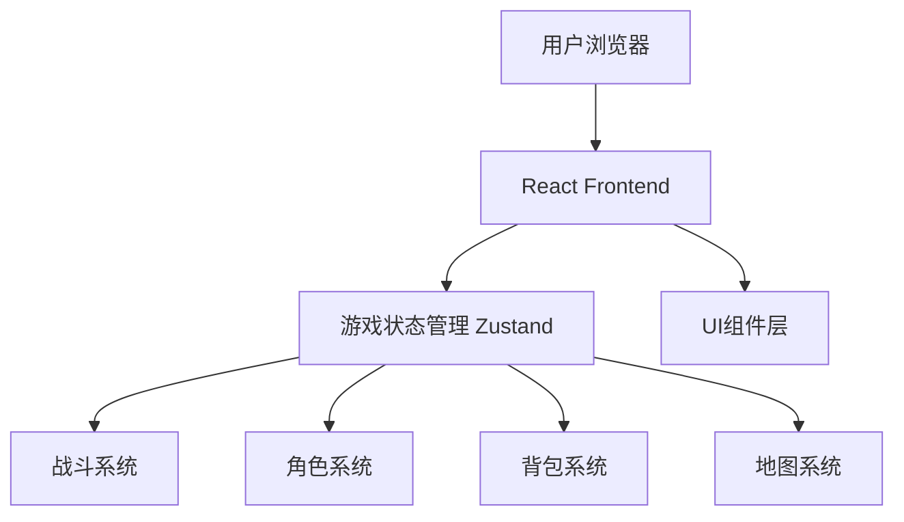
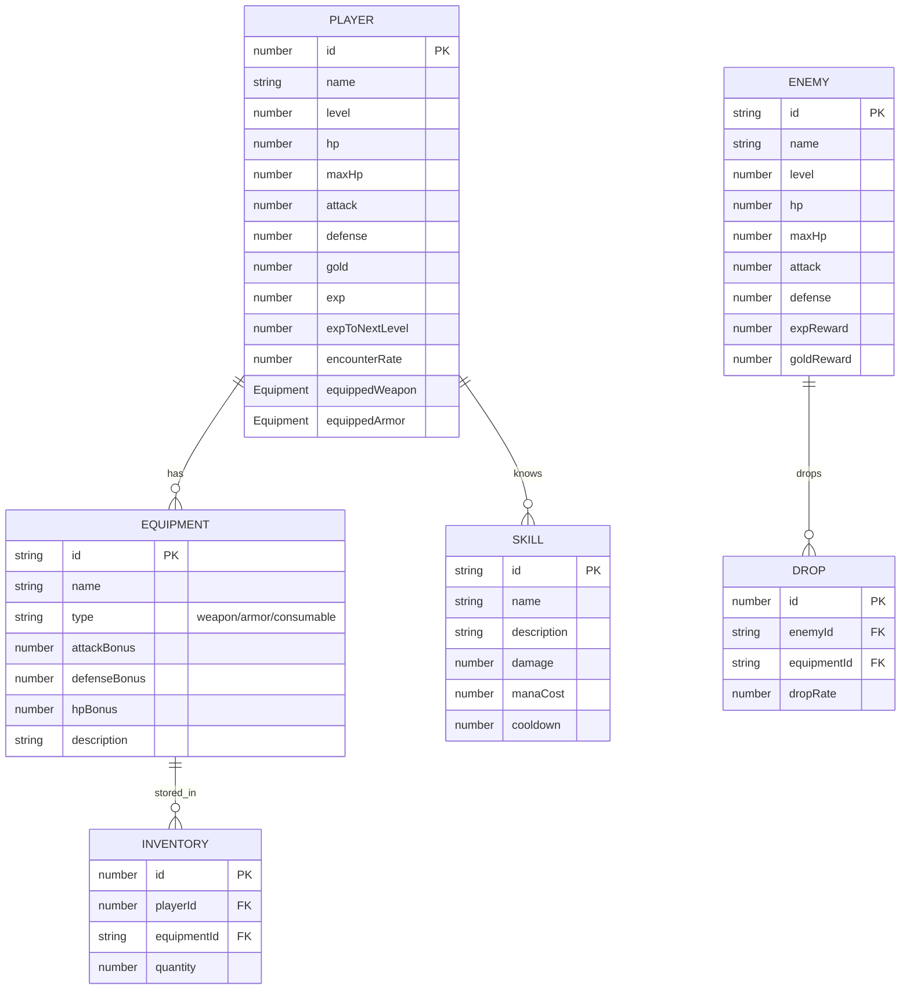

## 1. Architecture Design



## 2. Technology Description
- Frontend: React@18 + TypeScript + TailwindCSS@3 + Vite
- State Management: Zustand
- Game Rendering: HTML5 Canvas + CSS Sprites
- No backend required for demo (纯前端实现)

## 3. Route Definitions
| Route | Purpose |
|-------|---------|
| / | 游戏主场景页面 |

## 4. API Definitions
无后端API，所有数据存储在localStorage中

## 5. Data Model

### 5.1 数据模型定义


### 5.2 数据初始化
- 初始玩家数据：等级1，HP100，攻击10，防御5，金币0
- 初始背包：空
- 初始技能：普通攻击、治愈术
- 预设敌人：史莱姆、哥布林、骷髅兵等
- 预设装备：各种武器、防具、药水

## 6. 核心系统设计

### 6.1 移动系统
- 使用键盘WASD或方向键控制角色移动
- 角色只能在限定区域内移动(边界检测)
- 移动时增加遇怪值(每次移动+5~15随机)
- 遇怪值满100时触发战斗

### 6.2 战斗系统
- 回合制战斗，玩家先手
- 自动战斗：自动执行普通攻击循环
- 技能系统：消耗能量释放技能
- 物品系统：使用药水恢复HP
- 逃跑系统：50%成功率逃跑

### 6.3 背包系统
- 存储所有掉落装备
- 支持装备穿戴(武器、防具)
- 支持使用消耗品(药水)
- 装备效果实时生效

### 6.4 升级系统
- 战斗胜利获得经验值
- 经验值满时自动升级
- 升级提升HP、攻击、防御

## 7. 项目结构

```
src/
├── components/
│   ├── GameCanvas/       # 游戏画布组件
│   ├── StatusBar/        # 状态栏组件
│   ├── EncounterBar/     # 遇怪条组件
│   ├── Inventory/        # 背包组件
│   ├── BattleScreen/     # 战斗界面组件
│   └── ActionButtons/    # 操作按钮组件
├── stores/
│   └── gameStore.ts      # 游戏状态管理
├── systems/
│   ├── combat.ts         # 战斗系统逻辑
│   ├── movement.ts       # 移动系统逻辑
│   ├── encounter.ts      # 遇怪系统逻辑
│   └── inventory.ts      # 背包系统逻辑
├── data/
│   ├── enemies.ts        # 敌人数据
│   ├── equipment.ts      # 装备数据
│   ├── skills.ts         # 技能数据
│   └── initialData.ts    # 初始数据
├── types/
│   └── index.ts          # 类型定义
├── utils/
│   └── helpers.ts        # 工具函数
├── App.tsx
├── main.tsx
└── index.css
```

## 8. 技术实现要点

### 8.1 状态管理
使用Zustand管理全局游戏状态：
- 玩家数据
- 背包物品
- 当前场景(主场景/战斗/背包)
- 敌人数据
- 战斗状态

### 8.2 游戏渲染
- 使用Canvas绘制游戏地图和角色
- CSS动画实现角色移动效果
- 战斗特效使用CSS动画

### 8.3 数据持久化
- 使用localStorage保存游戏进度
- 自动保存玩家数据、背包、等级等信息

### 8.4 可扩展性设计
- 数据与逻辑分离，便于添加新敌人/装备/技能
- 模块化组件设计，易于扩展新功能
- 状态管理集中，便于添加新玩法